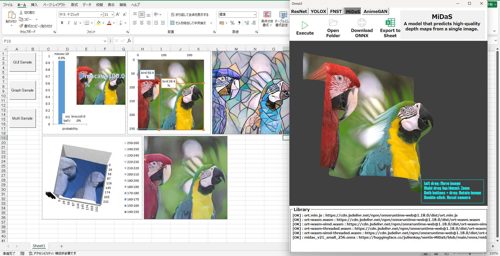

# VBA-ONNX-WasmBridge

This repository provides a demonstration of how to run an ONNX model from Microsoft Excel using VBA and PowerShell.  
It is intended **for learning and reference purposes only**, not for production use.

このリポジトリは、Microsoft Excel から VBA と PowerShell を用いて ONNX モデルを実行する方法を示すデモです。  
**学習用・参考用**を目的としており、実運用を想定したものではありません。

---
## Overview / 概要
- Load an image directly from Excel  
- Use VBA to prepare runtime files and call PowerShell  
- Run inference with ONNX Runtime Web (JavaScript + WebAssembly)  
- Display the result back in the Excel UserForm  

- Excel から直接画像を読み込み  
- VBA でランタイムファイルを準備し、PowerShell を呼び出し  
- ONNX Runtime Web（JavaScript + WebAssembly）で推論を実行  
- 結果を Excel のユーザーフォームに表示 (OpenGL使用)

## Supported ONNX Models / 対応ONNXモデル
- ResNet
- YOLOX
- MiDaS
- Fast Neural Style Transfer
- Anime GAN v2
- OnnxOCR

## Advantages / 利点

- **No installation required**  
  Everything runs inside Excel with VBA and PowerShell.  
  追加のインストール不要、Excel と PowerShell だけで動作します。

- **Works even in strict IT environments (kind of 😉)**  
  Since it only uses built-in tools (Excel, PowerShell, Edge), it can run in many corporate environments where installing Python or other runtimes is restricted.  
  会社の情報システム部門が厳しくても、Excel と標準機能だけで動くのがポイントです（たぶん…）。※問題が起きても知りません

- **Lightweight demo**  
  Just open the `.xlsm` file and you’re ready to experiment.  
  `.xlsm` を開くだけで試せる軽量デモです。

- **Note / 注意**  
  ONNX model and WebAssembly (WASM) files still need to be downloaded once.  
  So it’s “installation-free”… with a tiny asterisk.
  ONNX モデルと WASM ファイルは一度ダウンロードが必要です。  
  つまり「インストール不要」ですが、ちょっとした但し書き付きです

- **Offline execution**  
  Once the ONNX model and WASM files are downloaded, the demo can run completely offline.  
  ONNX モデルと WASM ファイルを取得してしまえば、その後は完全にオフラインで動作します。

## Features / 特徴
- Excel UserForm with buttons to:  
  - Select and display an image  
  - Open the temporary working folder  
  - Ensure runtime files are available  
  - Open Microsoft Edge to download the ONNX model  

- Excel のユーザーフォームに以下のボタンを用意：  
  - 画像を選択して表示  
  - 一時フォルダを開く  
  - ランタイムファイルを確認・取得  
  - Microsoft Edge を開いて ONNX モデルをダウンロード  
---

## Requirements / 必要環境
- Microsoft Excel with VBA enabled  
- Microsoft Edge (for manual ONNX file download)  
- PowerShell  

- VBA が有効な Microsoft Excel  
- Microsoft Edge（ONNX ファイルの手動ダウンロード用）  
- PowerShell  

---

## Usage / 使い方
1. Open the provided Excel file (`.xlsm`).  
2. Click **Ensure Runtime Files** to download the required JS/WASM files.  
3. If the ONNX model is missing, a message will appear.  
   - Microsoft Edge will open the download page.  
   - Please download the ONNX file manually and place it in the Temp folder shown in the message.  
4. Select an image (BMP or JPG) using the **Execute** button.  
5. Run inference and view the result in the form.  

1. 提供された Excel ファイル（`.xlsm`）を開く  
2. **Ensure Runtime Files** をクリックして必要な JS/WASM ファイルを取得  
3. ONNX ファイルが存在しない場合、メッセージが表示されるのでダウンロードボタンを押す  
   - Microsoft Edge が開き、ダウンロードページが表示される  
   - ファイルを手動でダウンロードし、メッセージに表示された Temp フォルダに配置  
4. **Execute** ボタンで画像（BMP/JPG）を選択  
5. 推論を実行し、結果をフォームに表示  

---
## Limitations / 制約
- ONNX models hosted on GitHub Model Zoo use LFS, so they cannot be downloaded automatically.  
- Users must manually download the ONNX file and place it in the Temp folder.  
- Please note that any ONNX models or class label files (e.g., ImageNet, COCO) downloaded from external sources must be used in accordance with the license terms provided by their respective distributors.
- Please make the input file name alphanumeric only, with no symbols.

- GitHub Model Zoo 上の ONNX モデルは LFS を利用しているため、自動ダウンロードはできません。  
- ユーザーが手動で ONNX ファイルをダウンロードし、Temp フォルダに配置する必要があります。  
- また、外部サイトからダウンロードした ONNX モデルやクラスラベルファイル（ImageNet、COCO など）は、配布元が定めるライセンス条件に従ってご利用ください。
- 入力ファイル名は英数字のみ、記号なしにしてください。

---

## Folder Structure / フォルダ構成
- `Temp\` – Temporary working folder created at runtime  
- `Temp\images\` – Stores selected images  
- `Temp\server.ps1` – PowerShell script for execution  
- `Temp\index.html` – JavaScript code for ONNX Runtime Web  
- `Temp\*.wasm` – ONNX Runtime WebAssembly files 

- `Temp\` – 実行時に作成される一時フォルダ  
- `Temp\images\` – 選択した画像を保存  
- `Temp\server.ps1` – 実行用 PowerShell スクリプト  
- `Temp\index.html` – ONNX Runtime Web 用 JavaScript  
- `Temp\*.wasm` – ONNX Runtime WebAssembly ファイル 
---

## Disclaimer / 免責事項
This project is provided **as-is** for educational and reference purposes.  
It is not intended for production environments.  

本プロジェクトは **学習および参考用** として提供されるものであり、実運用環境での利用を目的としたものではありません。

## Third‑Party Licenses
This project uses ONNX Runtime Web (MIT License).
Copyright (c) Microsoft Corporation.
